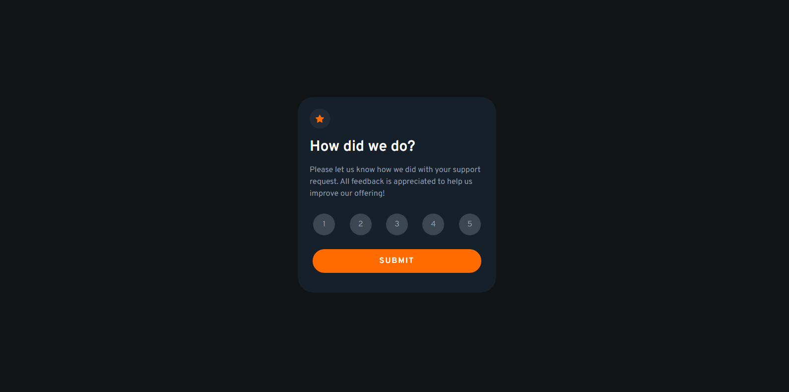

# Frontend Mentor - Interactive rating component solution

This is a solution to the [Interactive rating component challenge on Frontend Mentor](https://www.frontendmentor.io/challenges/interactive-rating-component-koxpeBUmI). Frontend Mentor challenges help you improve your coding skills by building realistic projects. 

## Table of contents

- [Overview](#overview)
  - [The challenge](#the-challenge)
  - [Screenshot](#screenshot)
  - [Links](#links)
- [My process](#my-process)
  - [Built with](#built-with)
  - [What I learned](#what-i-learned)
  - [Continued development](#continued-development)
- [Author](#author)

## Overview

### The challenge

Users should be able to:

- View the optimal layout for the app depending on their device's screen size
- See hover states for all interactive elements on the page
- Select and submit a number rating
- See the "Thank you" card state after submitting a rating

### Screenshot

### Links

- Live Site: [Live Site](https://devjhex-interactive-rating.netlify.app/)

## My process

### Built with

- Semantic HTML5 markup
- CSS custom properties
- Flexbox
- CSS Grid
- Mobile-first workflow
- TailwindCSS

### What I learned
I have repeated this project in pure Tailwind CSS and it is no different than the other ones that i built with pure CSS but to be honest Tailwind is way faster and since we will never write markup from scratch it is great for practicing CSS concepts.

### Continued development

I still want to progress with all the projects that i have built with Tailwind CSS so that i can get handy with it.

## Author
- Frontend Mentor - [@Dev-Jhex](https://www.frontendmentor.io/profile/Dev-Jhex)
- Twitter - [@devJhex](https://www.twitter.com/devJhex)

