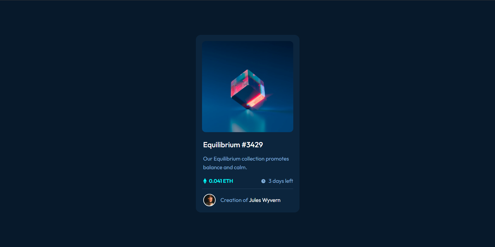

# Frontend Mentor - NFT preview card component solution

This is a solution to the [NFT preview card component challenge on Frontend Mentor](https://www.frontendmentor.io/challenges/nft-preview-card-component-SbdUL_w0U). Frontend Mentor challenges help you improve your coding skills by building realistic projects. 

## Table of contents

- [Overview](#overview)
  - [The challenge](#the-challenge)
  - [Screenshot](#screenshot)
  - [Links](#links)
- [My process](#my-process)
  - [Built with](#built-with)
  - [What I learned](#what-i-learned)
  - [Continued development](#continued-development)

- [Author](#author)

## Overview

### The challenge

Users should be able to:

- View the optimal layout depending on their device's screen size
- See hover states for interactive elements

### Screenshot

### Link
- Live Site URL: [Live Site](https://devjhex-nft-card.netlify.app/)

## My process

### Built with

- Semantic HTML5 markup
- Tailwind CSS
- Flexbox
- Mobile-first workflow

### What I learned
What I have learned in this project actually seemed to be minor at first but when i thought deeply, it's serious. And it is making stuff simple. For example for the line in the component, to be honest at first i said this is so simple i'll just have to create the div containing the icons (ethereum and clock together with their spans) and make the line with the after or before pseudo elements. And this solution is ok but is it simpler than just creating a div and giving it some minor styles. You do the math and see which is more readable and simpler 👩‍💻👩‍💻

### Continued development
I'm still going to build with Tailwind CSS but for sake of improving my skills on the technology, i want to explore more techniques to make it more useful in the framework.

## Author
- Frontend Mentor - [@Dev-Jhex](https://www.frontendmentor.io/profile/Dev-Jhex)
- Twitter - [@devJhex](https://www.twitter.com/devJhex)

