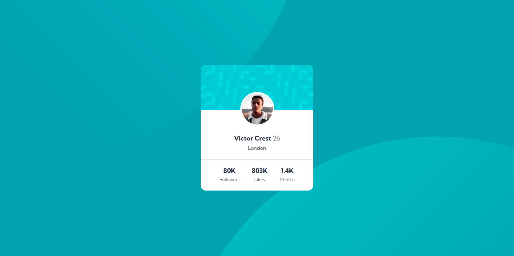

# Frontend Mentor - Profile card component solution

This is a solution to the [Profile card component challenge on Frontend Mentor](https://www.frontendmentor.io/challenges/profile-card-component-cfArpWshJ). Frontend Mentor challenges help you improve your coding skills by building realistic projects. 

## Table of contents

- [Overview](#overview)
  - [The challenge](#the-challenge)
  - [Screenshot](#screenshot)
  - [Links](#links)
- [My process](#my-process)
  - [Built with](#built-with)
  - [What I learned](#what-i-learned)
- [Author](#author)

## Overview

### The challenge

- Build out the project to the designs provided

### Screenshot

### Links

- Live Site URL: [Live Site](https://devjhex-profile-component.netlify.app/)

## My process

### Built with

- Semantic HTML5 markup
- Tailwind CSS
- Flexbox

### What I learned
What I learned particularly in this project is that sometimes some functionality that is pure CSS is not easy to get handy with in Tailwind CSS like i tried to make the same element have two background images at the same time but it was not easy until i had to make a div and have it be with the second Background image and thats how i worked it out. This taught me that sometimes you have to really use advantage of some fundamentals of CSS to get things done in Tailwind CSS and that's the beauty of it, It makes you still struggle a little bit hence its very important to understand the fundamentals.

## Author
- Frontend Mentor - [@Dev-Jhex](https://www.frontendmentor.io/profile/Dev-Jhex)
- Twitter - [@devJhex](https://www.twitter.com/devJhex)

