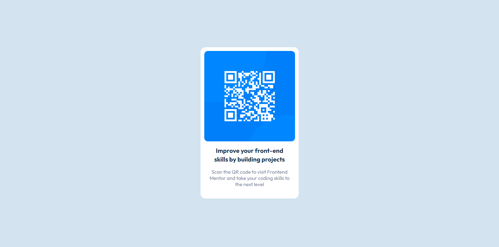

# Frontend Mentor - QR code component solution

This is a solution to the [QR code component challenge on Frontend Mentor](https://www.frontendmentor.io/challenges/qr-code-component-iux_sIO_H). Frontend Mentor challenges help you improve your coding skills by building realistic projects. 

## Table of contents

- [Overview](#overview)
  - [Screenshot](#screenshot)
  - [Links](#links)
- [My process](#my-process)
  - [Built with](#built-with)
  - [What I learned](#what-i-learned)
  - [Continued development](#continued-development)
  - [Useful resources](#useful-resources)
- [Author](#author)
- [Acknowledgments](#acknowledgments)

## Overview

### Screenshot

### Links

- Live Site URL: [:Live site](https://devjhex-qr-component.netlify.app/)

## My process

### Built with

- Semantic HTML5 markup
- Mobile-first workflow
- Tailwind CSS

### What I learned 
 With this project I continued with my journey of Tailwind CSS just as the previous ones and for this one the initial setup has been going well as far as speed is concerned. I will still emphasize that Tailwind is still CSS but shorter than the normal , meaning that you will still get some problems if you didn't master or get comfortable with your CSS. With that said i am really in love with Tailwind CSS and i'm ready to continue with it till the end of time.

If you want more help with writing markdown, we'd recommend checking out [The Markdown Guide](https://www.markdownguide.org/) to learn more.

### Continued development
Still as i've said previously and my last projects i will still use Tailwind CSS for long at least for now because it has so many advantages.

## Author

- Frontend Mentor - [@Dev-Jhex](https://www.frontendmentor.io/profile/Dev-Jhex)
- Twitter - [@devJhex](https://www.twitter.com/devJhex)
