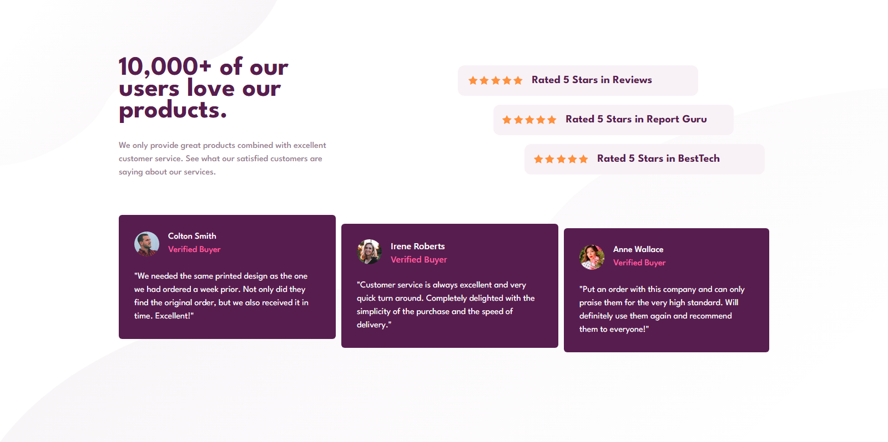

# Frontend Mentor - Social proof section solution

This is a solution to the [Social proof section challenge on Frontend Mentor](https://www.frontendmentor.io/challenges/social-proof-section-6e0qTv_bA). Frontend Mentor challenges help you improve your coding skills by building realistic projects. 

## Table of contents

- [Overview](#overview)
  - [The challenge](#the-challenge)
  - [Screenshot](#screenshot)
  - [Links](#links)
- [My process](#my-process)
  - [Built with](#built-with)
  - [What I learned](#what-i-learned)
- [Author](#author)

## Overview

### The challenge

Users should be able to:

- View the optimal layout for the section depending on their device's screen size

### Screenshot




### Links
- Live Site URL: [Live Site](https://devjhex-social-proof-section.netlify.app/)

## My process

### Built with

- Semantic HTML5 markup
- Flexbox
- Mobile-first workflow

### What I learned
In this project the most intimidating thing for me was the fact that I was looking for a better way to introduce multiple backgrounds in Tailwind CSS and honestly it was worst thing i have ever done. It was hectic to find a way to do this but eventually i did find a way which i will be writing about. And i general all of the multiple background capabilities in raw CSS is a little bit complicated in Tailwind for example sizing images in Tailwind is another demon😂 
```html
<div class='bg-[length:500px_300px,400px_300px]'>Hello world</div><!-- for the width and height of each of the images -->
```


## Author

- Frontend Mentor - [@Dev-Jhex](https://www.frontendmentor.io/profile/Dev-Jhex)
- Twitter - [@devJhex](https://www.twitter.com/devJhex)

